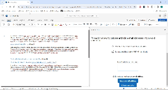

## e-mail validator Word Addin

This simple word addin allow for:
 - validating an input email address by checking it is syntactically valid and not disposable (i.e. fake temp email)
 - validating and extracting all email addresses in the selected word text

Demo:



This addin is for demonstrational purposes.

It uses yo office generator with react and typescript.

Make sure to load certificates when using an office addin:

```
npm install --global office-addin-dev-certs
npx office-addin-dev-certs install
```

Run the addin:

```
npm start
```
